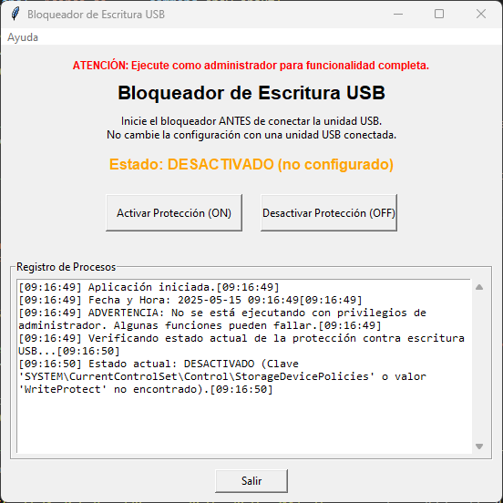

# USBWriteBlocker


# 🔒 Bloqueador de Escritura USB

## 🛠 Descripción
**Bloqueador de Escritura USB** es una aplicación de escritorio desarrollada en Python con Tkinter que permite al usuario activar o desactivar la protección contra escritura en dispositivos USB. Esto se logra mediante la modificación del registro de Windows.

> ⚠️ La aplicación requiere permisos de administrador para funcionar correctamente.

---

## 🎯 Funcionalidades

- ✅ Activar la protección contra escritura en puertos USB.
- 🔓 Desactivar la protección para permitir escritura.
- 📊 Ver el estado actual del sistema respecto a esta política.
- 🖼 Interfaz gráfica amigable y autoexplicativa.
- 📜 Terminal integrada para mostrar los procesos en tiempo real.
- 🔗 Acceso directo al repositorio desde el menú "Ayuda".

---

## 📦 Tecnologías utilizadas

- **Python 3.x**
- **Tkinter** (interfaz gráfica)
- **winreg** (acceso al registro de Windows)
- **ctypes** (verificación de permisos de administrador)

---

## ⚙️ Requisitos

- **Sistema operativo**: Windows 10/11
- **Python 3.6 o superior**
- Permisos de administrador para aplicar cambios en el registro

---

## 🚀 Cómo ejecutar

1. Asegúrate de tener Python instalado.
2. Clona o descarga el repositorio:
   ```bash
   git clone (https://github.com/freedmx/USBWriteBlocker)
   cd USBWriteBlocker
   ```
3. Ejecuta el archivo principal:
   ```bash
   python USBWriteBlocker.py
   ```

4. También puedes crear un acceso directo y configurarlo para ejecutar como administrador.

---

## 📄 Licencia

Distribuido bajo la licencia **GPL v3**. Ver archivo `LICENSE` para más detalles.

---

## 👨‍💻 Autor

**Jose Freddy Gabriel.**  
📅 Proyecto iniciado: 01/01/2025  
🔗 Repositorio: https://github.com/freedmx/USBWriteBlocker

---

## 🧠 Notas importantes

- El cambio tiene efecto inmediato, pero se recomienda reiniciar el sistema para asegurar su persistencia en algunas configuraciones.
- No conectes dispositivos USB mientras cambias la política para evitar resultados inesperados.
- Puedes personalizar colores, textos y otras funciones fácilmente desde el código fuente.
