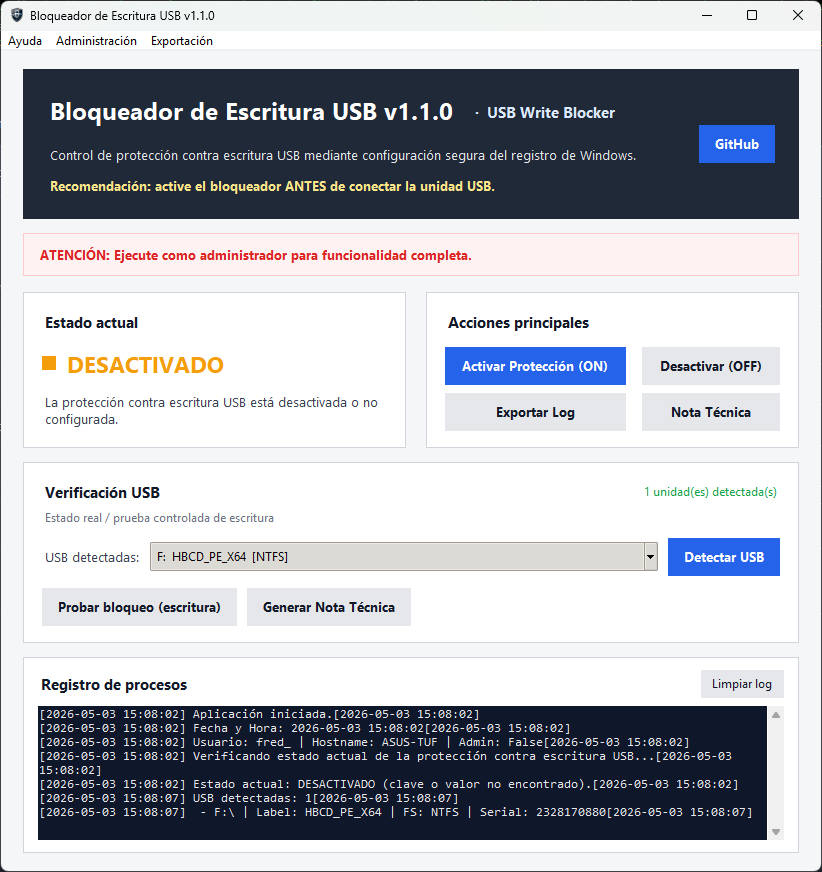

# 🔒 USB Write Blocker v1.1.0

# 🔒 Bloqueador de Escritura USB

Herramienta de escritorio desarrollada en Python para **controlar, verificar y documentar la protección contra escritura en dispositivos USB**, mediante la modificación segura del registro de Windows.

---

## 🛡 Descripción

**USB Write Blocker** permite activar o desactivar la protección contra escritura en unidades USB, evitando la alteración de evidencia digital o el uso no autorizado de dispositivos externos.

Está diseñada con un enfoque práctico para **análisis forense, ciberseguridad y entornos institucionales**.

> ⚠️ Requiere ejecución con privilegios de administrador.

---

## 🚀 Funcionalidades

- 🔐 Activar protección contra escritura USB
- 🔓 Desactivar protección
- 📊 Visualización del estado actual del sistema
- 🔍 Detección automática de dispositivos USB
- 🧪 Prueba real de escritura (validación)
- 📝 Generación de nota técnica
- 📄 Exportación de logs en formato TXT
- 🖥️ Interfaz gráfica moderna (Tkinter)
- 🎨 Icono integrado en ventana y barra de tareas
- 📜 Registro de procesos en tiempo real

---

## 🆕 Novedades v1.1.0

- ✨ Rediseño completo de la interfaz (UI moderna)
- 📌 Header informativo optimizado
- 📊 Mejor visualización del estado (ACTIVADO / DESACTIVADO)
- 🧾 Registro de procesos más amplio y legible
- 🎨 Integración de icono en aplicación y barra de tareas
- 🧠 Código documentado por secciones

---

## 📸 Interfaz

### Versión 1.1.0 (Actual)


### Versión anterior


---

## ⚙️ Requisitos

- Sistema operativo: Windows 10 / 11
- Python 3.8 o superior
- Permisos de administrador

---

## 🛠 Tecnologías utilizadas

- Python 3
- Tkinter (interfaz gráfica)
- winreg (registro de Windows)
- ctypes (verificación de privilegios)
- PyInstaller (compilación a ejecutable)

---
## 📦 Descarga

👉 Descargar aquí:  
https://github.com/freedmx/USBWriteBlocker/releases/latest


## 🚀 Ejecución

### 🔹 Método 1: Ejecutar desde código

```bash
git clone https://github.com/freedmx/USBWriteBlocker
cd USBWriteBlocker
python USBWriteBlocker.py

- El cambio tiene efecto inmediato, pero se recomienda reiniciar el sistema para asegurar su persistencia en algunas configuraciones.
- No conectes dispositivos USB mientras cambias la política para evitar resultados inesperados.
- Puedes personalizar colores, textos y otras funciones fácilmente desde el código fuente.
